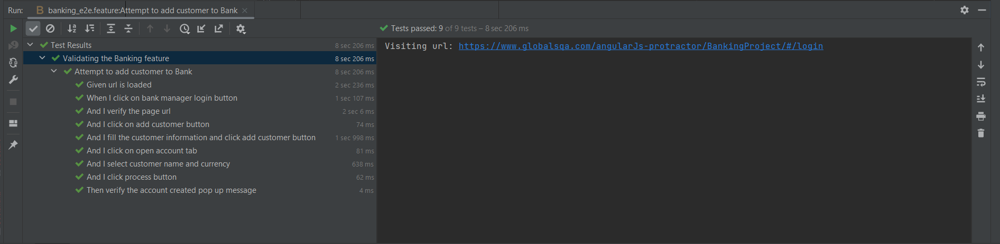
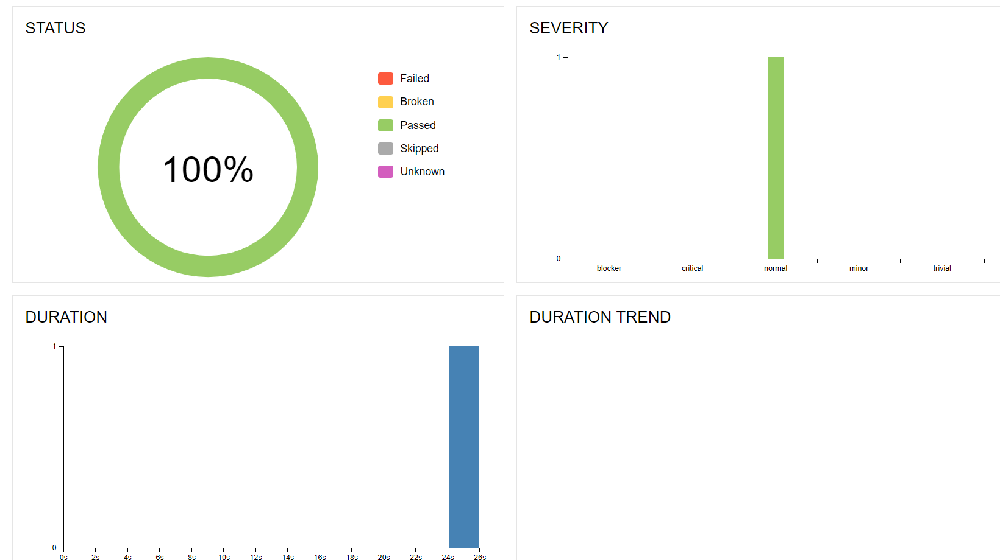

# Bank Automation
* https://www.globalsqa.com/angularJs-protractor/BankingProject/#/login

## Scenarios Automated:
1. Create Customer and validate the customer

## Implementation
  * Language used: Python (3.10)
  * Frameworks used: Selenium, behave, Cucumber
  * Page Object Method (POM), is used to implement the framework, all the
functionalities which lie inside that page becomes methods of the corresponding
class.
  * All the feature files contains in feature folder and all the steps and pages objects are resides in steps and pages
    folders respectively.
  * base_page.py contains all the reusable libraries like click, send_keys, wait etc

# Links

* [Github link to clone project](https://github.com/vishnumj005/banking-bdd.git)
* please note: the currently used version for python is 3.10.
* Install requirements before executing the scripts
  file before running the script.

# How to run test?

1. Via Terminal

    * Run `behave --tags=@{specific_tag}`
    * Run `behave --tags={tag1,tag2}`
    * Run `behave <path to feature file>`

2. Via PyCharm
    * Run directly from the feature file

3. Run Script with allure reporting
   * Run `behave -f allure_behave.formatter:AllureFormatter -o <path to result>`
   * Then Run `allure serve`

# Folder Structure

	.
	├── Root
	│     ├── steps                              # Step definitions
	│     │     ├── banking_steps.py
	│     │     ├── url_navigation_steps.py                           
	│     ├── feature
	│     │     ├── banking_e2e.feature          # Test scenarios
	│     ├── config                             # Configurations
	│     │     ├── browser
	│     │     │     └──driverfactory.py
	│     │     ├── constants
	│     │     │     └──constants.py
	│     │     ├── base_config.py
	│     ├── pages                             # Pages
	│     │     ├── base
	│     │     │     └──base_page.py
	│     │     ├── banking_pages.py
	│     │     ├── url_navigation_page.py
    │     ├── environment.py                    # Environments
    │     ├── requriements.txt                  # Required libraries
    │     ├── behave.ini                        # configuration ini file

# Output

